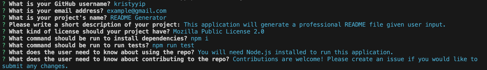
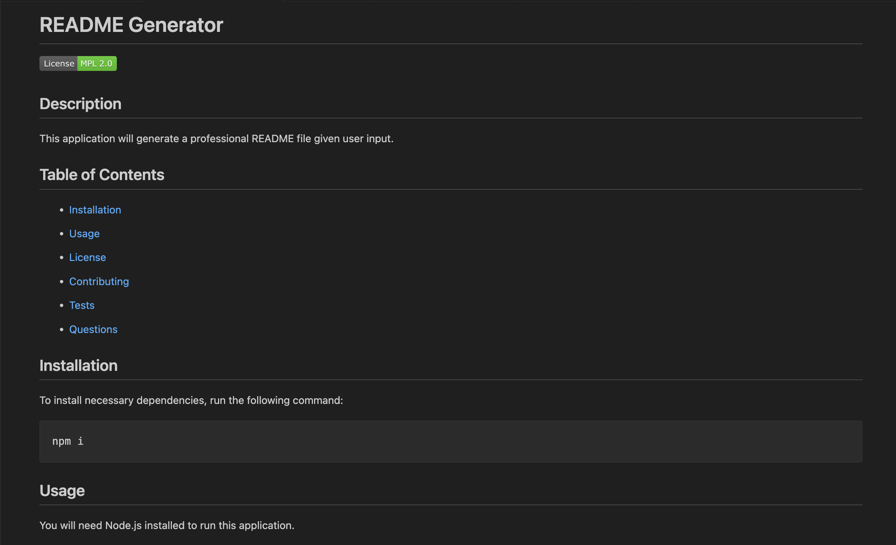
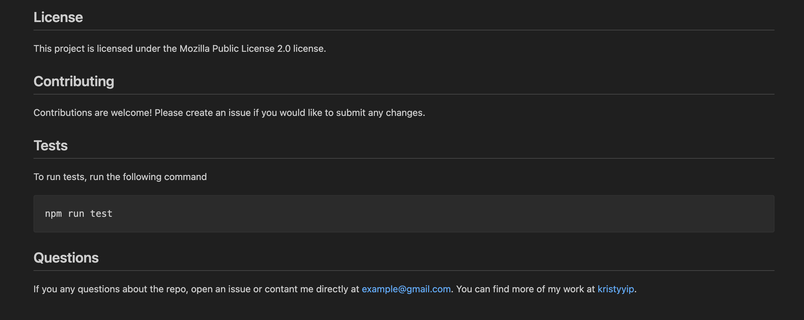

# Module 09: Node.js / README Generator

## Description
This is the challenge for Module 09 of the coding bootcamp. This is a command-line application that generates a professional README.md file through a series of prompts that accepts user input.

### User Story
```
AS A developer
I WANT a README generator
SO THAT I can quickly create a professional README for a new project
```

### Acceptance Criteria
```
GIVEN a command-line application that accepts user input
WHEN I am prompted for information about my application repository
THEN a high-quality, professional README.md is generated with the title of my project and sections entitled Description, Table of Contents, Installation, Usage, License, Contributing, Tests, and Questions
WHEN I enter my project title
THEN this is displayed as the title of the README
WHEN I enter a description, installation instructions, usage information, contribution guidelines, and test instructions
THEN this information is added to the sections of the README entitled Description, Installation, Usage, Contributing, and Tests
WHEN I choose a license for my application from a list of options
THEN a badge for that license is added near the top of the README and a notice is added to the section of the README entitled License that explains which license the application is covered under
WHEN I enter my GitHub username
THEN this is added to the section of the README entitled Questions, with a link to my GitHub profile
WHEN I enter my email address
THEN this is added to the section of the README entitled Questions, with instructions on how to reach me with additional questions
WHEN I click on the links in the Table of Contents
THEN I am taken to the corresponding section of the README
```

## Application
You can see how the project works [here](https://drive.google.com/file/d/1NkLNBJJ1VNcljsf6kGrsvI6B4CJCeXTv/view?usp=sharing).

The user will be prompted to answer a series of questions through the command line.


A README.md will be generated based on the user input above.



## Citations
Karagözgil, Murat (2023). "Software Licenses on GitHub: Which One Should You Choose?" https://muratkaragozgil.medium.com/software-licenses-on-github-which-one-should-you-choose-3d4cfbb6c2f9#:~:text=The%20most%20popular%20software%20license,Apache%20License%202.0. (index.js)

Salvadór, Christian C. and jolyonruss (2009, 2015). "Replace spaces with dashes and make all letters lower-case." https://stackoverflow.com/questions/1983648/replace-spaces-with-dashes-and-make-all-letters-lower-case. (generateMarkdown.js)

Kofia, Victor (2017). "Markdown License badges." https://gist.github.com/kofiav/c1059e1075b67582e86b07aa9759e20d. (generateMarkdown.js)